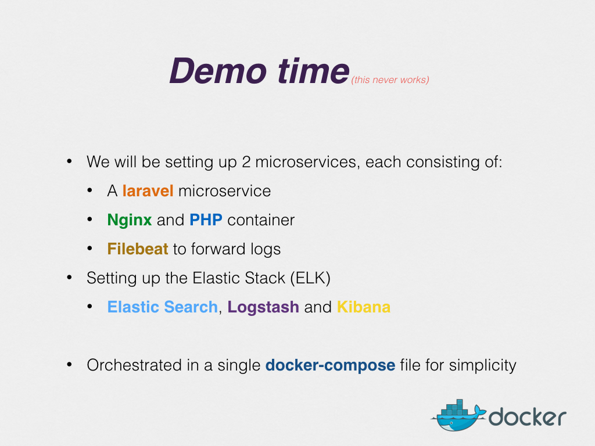

# Centralised logging system using Laravel with Elastic Stack. Wired up with docker-compose

This repository contains the code I did in the live demo at the Copenhagen Laravel Meetup http://www.meetup.com/Copenhagen-Laravel-Meetup/events/231241447/ hosted at Tattoodo

Contains a docker-compose declaration that boots up both laravel services and the Elastic Stack (5).

The Laravel services is pretty much bare bone out of the box. Only configuration done was changing the logging format in Monolog to logstash. That happens in `app/Providers/AppServiceProvider.php`

After `docker-compose up`:

* Content API: http://localhost:8080
* Image API: http://localhost:8081
* Kibana: http://localhost:5601

The session was recorded and will be uploaded soon.

# Slides

